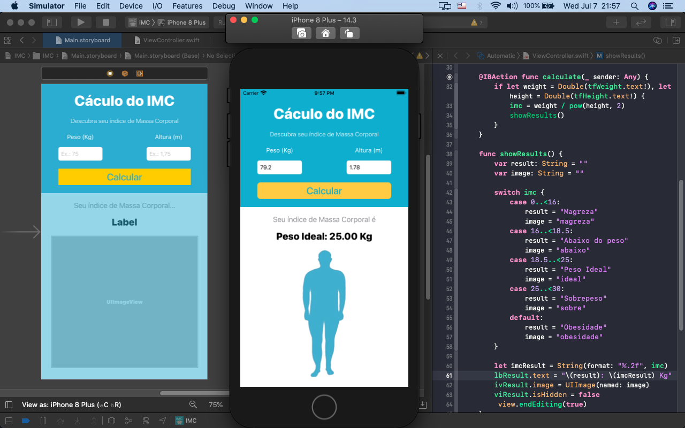

<h1 align="center">
    Calculo IMC
</h1

     

 

## 🔖  Calculo IMC

App simples para ensinar como utilizar Storyboards, auto layout para ajustar os compentes em vários dispositivos.
 

## 🚀 Linguagens e Habilidades que são desenvolvidas no APP

- Swift 4
- iOS 11
- Auto Layout
- Storyboard

## 🔖 Sites dos idealizadores do programa

- Link do Curso [link](https://www.udemy.com/course/curso-completo-de-desenvolvimento-ios11swift4/).

---

Feito com ♥  by Thyago Raphael :wave:
