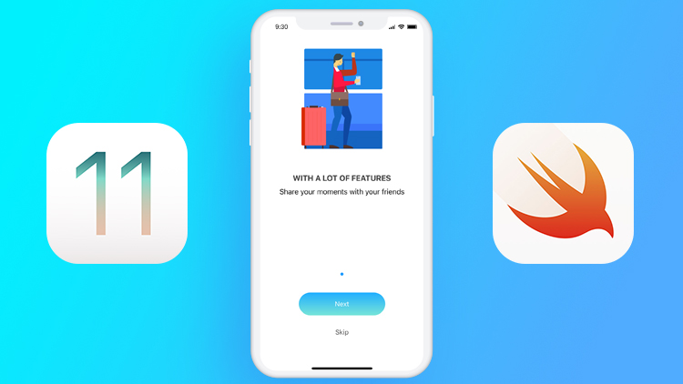

<h1 align="center">
    Curso Completo iOS 11 Swift 4 - Eric Brito
</h1

     

 

## 🔖  Sobre o Curso

O Curso visa tornar um desenvolvedor iOS através da criação de 20 apps e games completos utilizando Swift 4, Xcode 9 e iOS 11!
 

## 🚀 Linguagens e Habilidades que serão desenvolvidas no programa

- Swift 4
- iOS 11
- Auto Layout
- Lógica de Programação
- MVC
- Persistência de dados com CoreData
- Gerenciamento de dependências com CocoaPods
- Rest

## 🔖 Sites dos idealizadores do programa

- Link do Curso [link](https://www.udemy.com/course/curso-completo-de-desenvolvimento-ios11swift4/).

## 🔖 Redes Sociais

- [Linkedin](https://www.linkedin.com/mwlite/in/thyago-raphael-396b48215)
- [Instagram](https://www.instagram.com/traphael.dev/)
---

Feito com ♥  by Thyago Raphael :wave:
